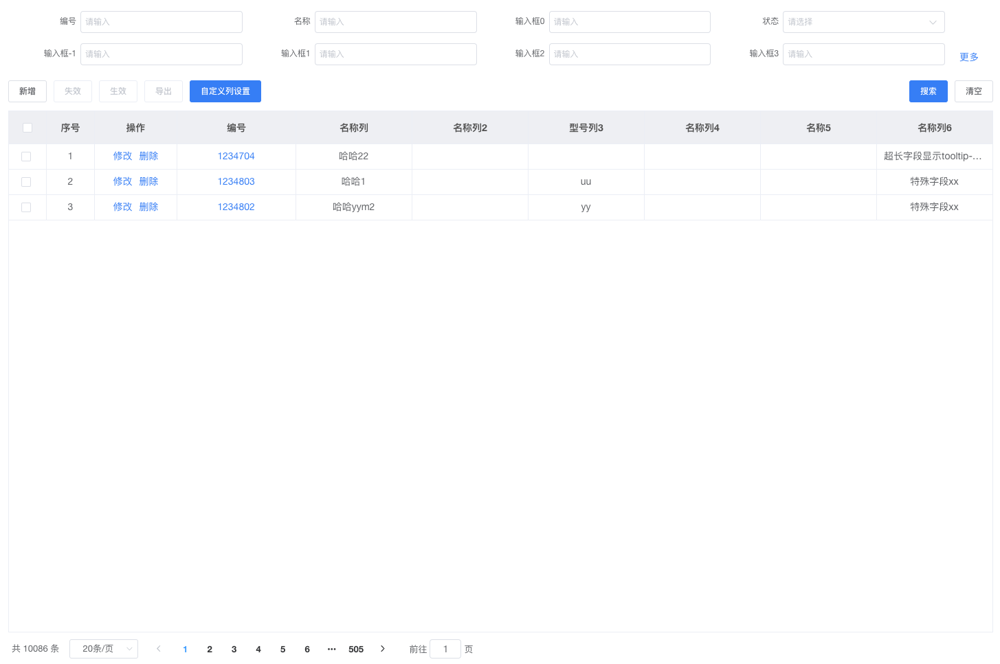

# ele-list-page

超级列表页 --- 一个基于element-ui的vue插件

## 样式

[](https://github.com/tiandaoyi/ele-list-page "演示图片")

## 重要功能

1. 前端配置搜索字段，实现后端搜索table（支持input输入框、select下拉选择、time时间选择器）
2. 后端分页，只需要传一个函数，即可实现所有分页器操作
3. 列表支持动态设置自定义列
4. 列表整体高度动态计算，正常使用列表页不会超过1页
5. 所有属性均支持可配置，如果觉得不够可以提issue

## 适用场景

列表页面直接通过配置js对象及方法就可以使用，不涉及vuex，但是部分功能需要后端支持（如分页）。

## 使用

```
// 安装
npm i ele-list-page

// main.js
// 组件引入
import EleListPage from 'ele-list-page'
Vue.use(EleListPage)

// 组件样式引入
import 'ele-list-page/src/lib/index.css'

// 组件是基于element-ui的，所以也需要引入element-ui
import ElementUI from 'element-ui';
Vue.use(ElementUI)

// list.vue template部分
<EleListPage
  :tableCommonOptions="tableCommonOptions"
  :listLoading="listLoading"
  :loadTableData="loadTableData"

  :tableList="tableList"
  :onSaveCustom="onSaveCustom"

  :searchForm="searchForm"
></EleListPage>

// list.vue js部分
data() {
  const tableCommonOptions = {
    searchOptions: {
      isAllHidden: false,
      searchData: [
        {
          name: '编号',
          searchField: 'code',
        },
        {
          name: '名称',
          searchField: 'name',
        },
        {
          name: '输入框0',
          searchField: 'spec',
        },
        {
          name: '状态',
          searchField: 'status',
          searchType: 'select'
        },
        {
          name: '输入框-1',
          searchField: 'categoryCode',
        },
        {
          name: '输入框1',
          searchField: 'categoryName',
        },
        {
          name: '输入框2',
          searchField: 'brandCode',
        },
        {
          name: '输入框3',
          searchField: 'brandName',
        },
        {
          name: '输入框4',
          searchField: 'materials',
        },
      ],
    },
    filterOptions: {
      isAllHidden: false,
      left: [
        {
          filterType: 'add',
          disabled: false,
          type: 'info'
        },
        {
          filterType: 'invalid',
          disabled: false
        },
        {
          filterType: 'valid',
          disabled: false
        },
        {
          filterType: 'export',
          disabled: true
        },
        {
          filterType: 'customColumns'
        }
      ],
      right: [
        {
          filterType: 'search',
          fn: () => {
            this.loadTableData();
          }
        },
        {
          filterType: 'clear',
          fn: () => {
            this.searchForm = {};
            // 看是否需要调用搜索
            this.loadTableData();
          }
        },
      ]
    },
    tableOptions: {
      underlineHandles: {
        code: ({row}) => {
          const params = {
            code: row.code || null 
          }
          alert('gotoDetail');
        }
      },
      columnsData: {
        showColumns: [],
        hiddenColumns: []
      },
      headerHandleOperation: {
        prop: 'operation',
        label: '操作',
        operationOptions: [{
          name: '修改',
          fn: ({row: {code}}) => {
            const params = {
              code
            }
            alert('gotoDetail');
          },
          disabled: false
        }, {
          name: '删除',
          type: 'danger',
          fn() {
            console.log('删除')
          },
          disabled: true,
        }]
      }
    },
    pagination: {
      total: 0,
      pageNo: 1,
      pageSize: 20
    }
  };
  return {
    tableCommonOptions,
    listLoading: false,
    searchForm: {},
    tableList: [],
  }
},
methods: {
  onSaveCustom(selectedNumber, closeDialog) {
    // 保存自定义列
    const request = {
      userModuleColumnsReqs: (selectedNumber || []).map((item, index) => {
        return {
          columnId: item,
          seq: index + 1
        }
      })
    };
    // 此处需要自己处理@TODO
    this.$store.dispatch('commodityInfoList/saveCustomColumns', request).then(() => {
      this.loadCustomColumnsList();
      // 更新列表数据
      this.loadTableData();
      closeDialog && closeDialog();
    })
    // 保存自定义列
  },
  loadSearchList() {
    // 初始化搜索项
    const searchData = this.tableCommonOptions.searchOptions.searchData;
    const newSearchData = [...searchData];
    // 搜索项下拉框列表填充
  },
  loadTableData() {
    const searchForm = this.searchForm;
    const searchObject = {}
    const oldSeachForm = {...searchForm};
    const request = {
      ...searchObject,
      startPage: this.tableCommonOptions.pagination.pageNo,
      pageSize: this.tableCommonOptions.pagination.pageSize
    }

    //getTableList(request).then(({data: {data: tableList, total}}) => {
    // 表格数据更新
    //  this.tableList = tableList || [],
    //  this.tableCommonOptions.pagination = {
    //    ...this.tableCommonOptions.pagination,
    //    total
    //  }
    //});

  },
  loadCustomColumnsList() {
    // 获取自定义列列表
    //getCustomizedColumnsList().then(({data}) => {
    //  // 接口的数据结构showColumns = [{showName, showField, id, refField}]
    //  // table表头所需
    //  const columnsMatchParams = {
    //    prop: 'showField',
    //    label: 'showName'
    //  };
    //  // 自定义列所需
    //  const customColumnsMatchParams = {
    //    key: 'id',
    //    label: 'showName'
    //  }
    //  const tableCommonOptions = this.tableCommonOptions;

    //  tableCommonOptions.tableOptions = {
    //    ...tableCommonOptions.tableOptions,
    //      columnsData: data,
    //      columnsMatchParams,
    //      customColumnsMatchParams
    //  }
    //})
  },
},
mounted() {
  // // 初始化搜索项
  this.loadSearchList();
  // // 加载自定义列数据
  this.loadCustomColumnsList();
  // 加载表格数据
  this.loadTableData();
}

```

## Build Setup

``` bash
# install dependencies
npm install

# serve with hot reload at localhost:8080
npm run dev

# build for production with minification
npm run build
```

For detailed explanation on how things work, consult the [docs for vue-loader](http://vuejs.github.io/vue-loader).
